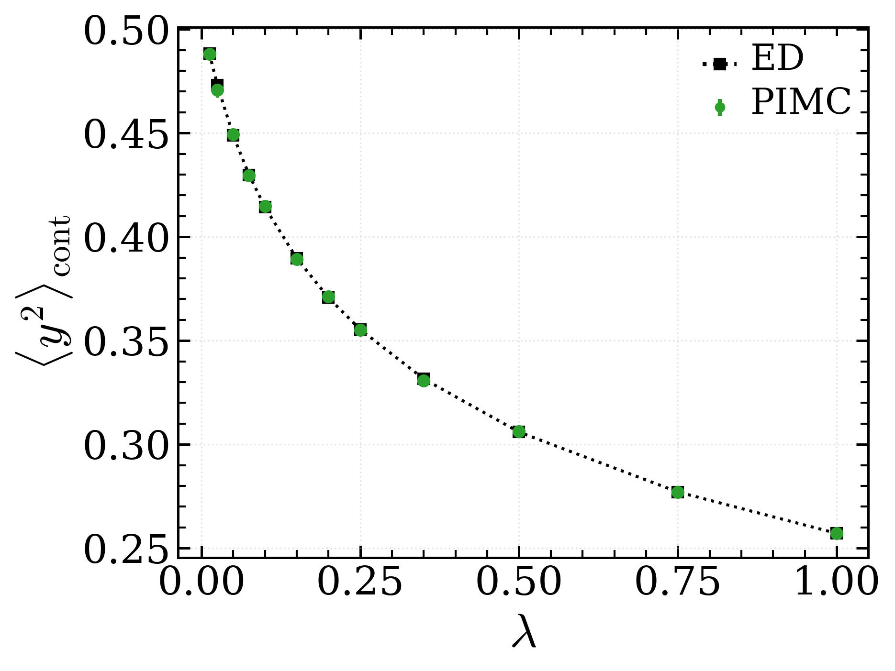
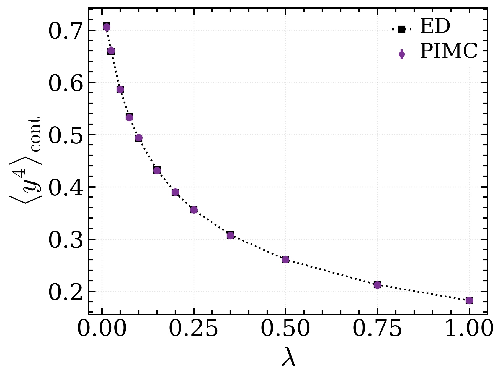
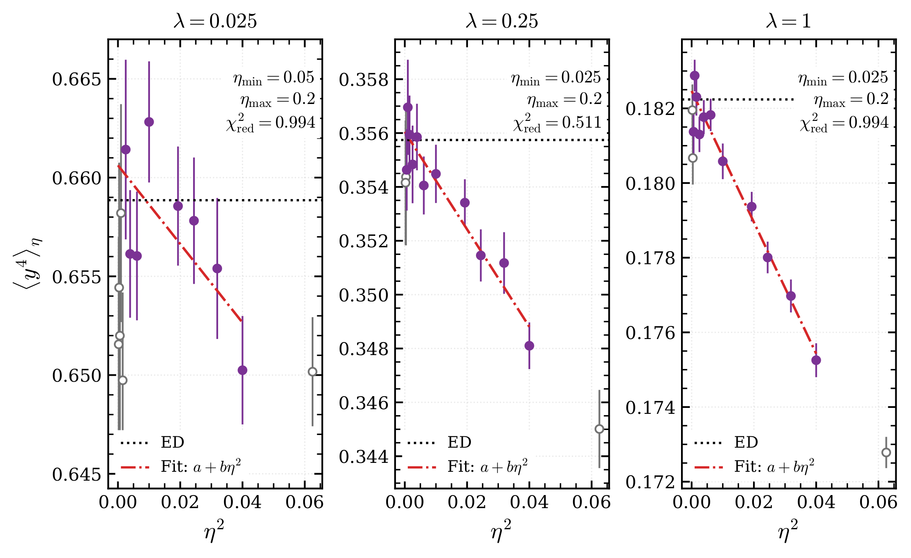
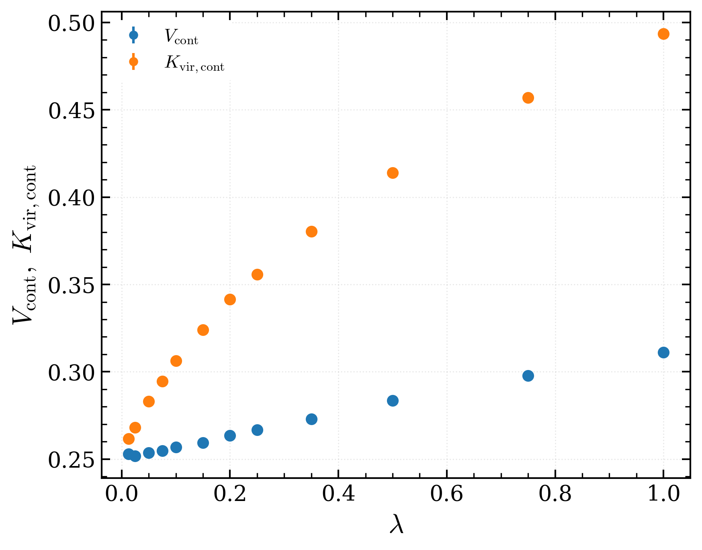
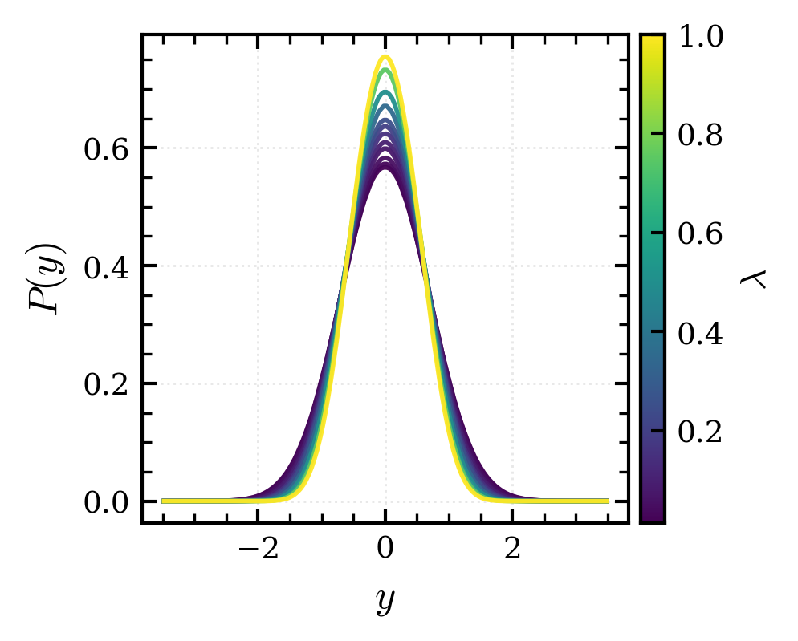
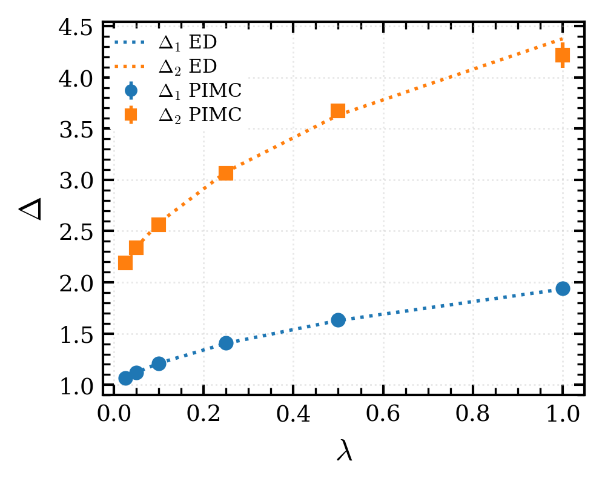
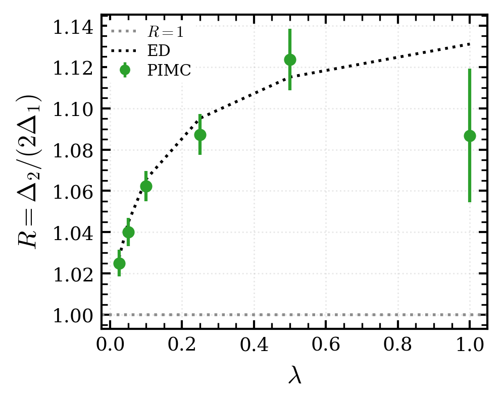

# Quartic Anharmonic Oscillator: Path-Integral Monte Carlo

[](../LICENSE)


> **Module 3** — *Numerical Methods for Physics (Metodi Numerici per la Fisica)*, University of Pisa

This module extends the Euclidean path-integral treatment of the harmonic
oscillator by adding a positive quartic interaction. The coupling $\lambda$
deforms the equilibrium position density, changes the thermal moments and
virial balance, and shifts the excitation spectrum away from equal harmonic
level spacing.

## 📄 Laboratory Report

Complete laboratory report for the *Numerical Methods for Physics - Module 3*:

**[Path-Integral Monte Carlo for Harmonic and Quartic Oscillators — Laboratory Report](../Report_Path_Integral_Monte_Carlo_for_Harmonic_and_Quartic_Oscillators.pdf)**<br>
University of Pisa, A.A. 2025/2026.

---

## ✨ Key Features

- **Euclidean Path Integral:** Sample periodic paths for the potential
  $V(y)=y^2/2+\lambda y^4$.
- **Continuum Limit:** Extrapolate observables at fixed $\beta=5$ in $\eta^2$.
- **Thermodynamic Estimators:** Measure $\langle y^2\rangle$,
  $\langle y^4\rangle$, and virial components.
- **Position Distribution:** Follow the deformation of $P(y)$ across the
  coupling scan.
- **Spectral Analysis:** Extract $\Delta_1$ and $\Delta_2$ from connected odd
  and even correlator matrices.
- **Quartic Interaction:** Compare coupling-dependent moments and gaps with
  exact diagonalization.

---

## 📁 Directory Structure

```text
quartic_anharmonic_oscillator/
├── Makefile
├── src/                 Quartic PIMC implementation
├── include/             C interfaces
├── scripts/
│   ├── run/             Continuum and spectrum ensemble definitions
│   ├── analysis/        Continuum, virial, and spectral analyses
│   └── plot/            Report-figure generation
├── data/                Git-ignored local runtime outputs
└── plots/
    ├── distribution/        Position-density result
    ├── spectrum/            Excitation gaps and gap ratio
    └── thermodynamic/       Moments and virial observables
```

---

## 🚀 Getting Started

### Requirements

The sampler requires GCC or another C99 compiler, Make, and the system
mathematics library. Analysis and plotting require Python 3.8 or newer with
NumPy, SciPy, and Matplotlib.

### Build

```bash
make clean
make all
```

The resulting executable is `bin/anharmonic_pimc`.

### Continuum ensembles

The retained runner prints the fixed-$\beta=5$ production grid by default:

```bash
bash scripts/run/run_beta5_continuum_scan.sh
```

After reviewing the grid, enable the actual simulation explicitly:

```bash
RUN_PRODUCTION_V2=1 bash scripts/run/run_beta5_continuum_scan.sh
```

Runtime outputs are written below `data/` and are not distributed.

## 🎯 Physics Objectives

The dimensionless quartic oscillator is defined by

$$H=\frac{p^2}{2}+V(y),\qquad V(y)=\frac{1}{2}y^2+\lambda y^4.$$

For $N_t$ Euclidean-time slices, $\eta=\beta/N_t$, and periodic paths, the
lattice action is

$$S_{\mathrm{quartic}}[y] = \sum_{n=0}^{N_t-1}\left[\frac{(y_{n+1}-y_n)^2}{2\eta}+\eta\left(\frac{1}{2}y_n^2+\lambda y_n^4\right)\right],\qquad y_{N_t}=y_0.$$

* **Continuum Limit:** Determine quartic observables as $\eta\to0$ at fixed
  $\beta=5$.
* **Thermal Moments:** Study $\langle y^2\rangle$ and $\langle y^4\rangle$
  across the coupling scan.
* **Virial Relation:** Compare kinetic and potential contributions, including
  the term proportional to $\lambda\langle y^4\rangle$.
* **Position Distribution:** Resolve the narrowing and non-Gaussian deformation
  of $P(y)$ with increasing $\lambda$.
* **Euclidean Spectrum:** Construct connected matrices in the odd
  $\{y,y^3\}$ and even $\{y^2,y^4\}$ sectors to extract $\Delta_1$ and
  $\Delta_2$.
* **Gap Ratio:** Compare $\Delta_2/(2\Delta_1)$ with exact diagonalization.

---

## 📊 Results

The seven retained quartic figures show how continuum observables, probability
densities, and excitation gaps evolve with $\lambda$. No runtime tables are
required merely to view these report figures.

<details>
<summary><b>Thermodynamic observables</b></summary>
<br>

| (a) Continuum $\langle y^2\rangle$ | (b) Continuum $\langle y^4\rangle$ |
|:---:|:---:|
|  |  |

| $\eta^2$ continuum fits for $\langle y^4\rangle$ |
|:---:|
|  |

| Virial components |
|:---:|
|  |

</details>

<details>
<summary><b>Spatial and spectral properties</b></summary>
<br>

| (a) Position density | (b) Excitation gaps | (c) Gap ratio |
|:---:|:---:|:---:|
|  |  |  |

</details>

---

## 🔧 Build System

The retained Makefile targets are:

| Target | Purpose |
|:---|:---|
| `all` | Build `bin/anharmonic_pimc` |
| `analyze` | Construct continuum moments and virial summaries from local ensembles |
| `plots` | Generate the seven retained figures from the required local analyses |
| `clean` | Remove the compiled executable directory |

After the required ensembles have been generated locally, the standard
analysis and plotting sequence is:

```bash
make analyze
make plots
```

The retained spectrum scan and analysis entry points are:

```bash
RUN_SPECTRUM_SCAN_QUICK=1 bash scripts/run/run_spectrum_coupling_scan.sh
python3 scripts/analysis/analyze_spectrum_coupling_scan.py
python3 scripts/analysis/analyze_spectrum_lattice_spacing.py
```

The spectrum analyses also require a locally generated exact-diagonalization
reference with the paths and coupling grid appropriate to the scan.

---

## ♻️ Data and Reproducibility

Raw ensembles, block correlators, processed continuum tables, and
exact-diagonalization tables are not distributed. They are generated locally
below `data/`, where runtime outputs remain ignored by Git. The seven quartic
PNG figures used in the report are included below `plots/`.

Numerical reproduction requires running the simulation and analysis stages
before the plotters. The distributed figures do not imply that the required
data are already present.

## 📚 Bibliography

### Books

- W. Krauth, *Statistical Mechanics: Algorithms and Computations*, Oxford
  University Press (2006).
- D. P. Landau and K. Binder, *A Guide to Monte Carlo Simulations in
  Statistical Physics*, 5th ed., Cambridge University Press, 2021.

### Articles

- M. Creutz and B. Freedman, “A statistical approach to quantum mechanics,”
  *Annals of Physics* **132**, 427–462, 1981.
- D. M. Ceperley, *Reviews of Modern Physics* **67**, 279–355 (1995).
- C. Bonati and M. D’Elia, *Physical Review E* **98**, 013308 (2018).

### Lecture Notes and Software

- C. Bonati, *Some notes for Metodi Numerici per la Fisica / Computational
  Physics Laboratory*, lecture notes, Università di Pisa, version of 29 June
  2026.
- M. D'Elia, *Appunti del Corso di Metodi Numerici della Fisica Teorica / Parte
  III - Applicazioni al calcolo del path-integral in meccanica quantistica*,
  lecture notes, Università di Pisa, 2016.
- **Bonati, Claudio** *Numerical Methods*.
  GitHub repository: [https://github.com/claudio-bonati/NumericalMethods](https://github.com/claudio-bonati/NumericalMethods)

## 📝 License

This module is released under the repository-level [MIT License](../LICENSE).
